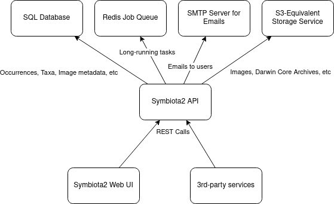

# Symbiota2

This project was uses [Nx](https://nx.dev), [Angular](https://angular.io), and [Nest](https://nestjs.com).

## Quick Start & Documentation

[Nx Documentation](https://nx.dev/angular)

[Angular Documentation](https://angular.io/docs)

[Nest Documentation](https://docs.nestjs.com/)

[Tutorial on writing a Symbiota2 API endpoint](./docs/tutorials/simpleWebService.md)

[Tutorial on writing a Symbiota2 UI page](./docs/tutorials/simpleWebPage.md)

How to get an instance running on a Linux box:

1. Install docker (`sudo apt install docker-compose`)
2. Install nodeJS and manager (`sudo apt install npm`)
3. Clone Symbiota2 (`git clone https://gitlab.com/willpearse/symbiota2.git`; `sudo apt install git` if Git isn't installed)
4. Install nx development environment (`npm i npx`)
5. Start Symbiota dependencies (`sudo docker-compose up -d`)
6. Launch npm environment (`npx`)
7. Launch Symbviota front-end server (`nx serve ui`)
8. Go to the web-address that now appears in your terminal window. Congratulations! You're running Symbiota2!

## Environment

Any variable without a default is required for the Symbiota2 API to run. 
For development, a [.env file](https://www.npmjs.com/package/dotenv) can be used.

| Environment variable | Description | Default |
| -------------------- | ----------- | ------- |
| NODE_ENV | 'development' or 'production', determines log level, etc. | 'production'
| APP_PORT | The port the the API server will run on | 8080 |
| APP_DATA_DIR | The data directory for the API server | './data' |
| DATABASE_TYPE | The scheme for the database uri | 'mariadb' |
| DATABASE_HOST | The database host | '127.0.0.1' |
| DATABASE_PORT | The database port | 3306 |
| DATABASE_NAME | The name of the database on DATABASE_HOST | 'symbiota' |
| DATABASE_USER | The user used to connection to DATABASE_NAME | 'root' |
| DATABASE_PASSWORD | The password for DATABASE_USER | 'password' |
| REDIS_HOST | The redis server to use for asynchronous job queues | '127.0.0.1' |
| REDIS_PORT | The port for REDIS_HOST | 6379 |
| SMTP_HOST | The smtp server to use for sending emails | '127.0.0.1' |
| SMTP_PORT | The port to use on SMTP_HOST | 25 |
| SMTP_USER | The optional user to use for authentication with SMTP_HOST | '' |
| SMTP_PASSWORD | The optional password for SMTP_USER | '' |
| SMTP_SENDER | The email address that emails will originate from | 'noreply@symbiota2.org' |
| STORAGE_SERVER | The S3 server to use for backend storage | '127.0.0.1' |
| STORAGE_USER | The AWS Access Key ID (or equivalent) to use for authentication with STORAGE_SERVER | 'symbiota2' |
| STORAGE_PASSWORD | The AWS Secret Access Key (or equivalent) to use for authentication with STORAGE_SERVER | 'password' |
| STORAGE_BUCKET | The S3 bucket to use on STORAGE_SERVER | 'symbiota2' |
| ENABLE_AUTH | FOR DEBUGGING ONLY: Set to 0 to disable API authentication | 1 |

## Overall architecture

## Database

The Symbiota2 API uses [TypeORM](https://typeorm.io) to manage databases migrations and entities, so in theory any
database that's compatible with TypeORM is compatible with Symbiota2. However, currently SQLite experiences issues due to
a lack of support for spatial indexes. MariaDB is the only database that has been tested.

For development purposes, `docker-compose up -d` will start a mariadb server on port 3306 compatible with the
DATABASE_* defaults. This database loads the initialization scripts in [docker-entrypoint-initdb.d](./docker-entrypoint-initdb.d/)
to initialize a [Symbiota v1 database](https://github.com/Symbiota/Symbiota/blob/f158b1651632ecfe018d7c5d578e7fa8d904fb04/docs/INSTALL.txt#L26).
This repo also provides a convenience script for running a sql file or directory of sql files. This script utilizes the environment
variables above to connect to the database:

`npm run sql my-script.sql`

or

`npm run sql my/dir/with/sql/scripts`

Symbiota2 has been written under the assumption that most users will be upgrading from a Symbiota v1 database. Any new databases
should first run the initialization scripts in docker-entrypoint-initdb.d. When ready to upgrade to the Symbiota2 schema, run
`npm run typeorm migration:run`. This will load the schema updates from the [migrations directory](./libs/api-database/src/migrations).

During development, if any [entities](./libs/api-database/src/entities) are changed, a migration should be generated using 
`npm run typeorm migration:generate -- -n MyMigration`.

A key requirement of Symbiota2 is backward-compatibility with Symbiota v1 databases. For this reason, care should be taken
that any migrations do not result in data loss. However, **all users need to back up their data prior to upgrading to Symbiota2** as 
it's always possible that data loss could occur.

More information on the database schema can be found here:
- [Institutions/Collections/Occurrences/Taxa](./docs/occurrences.md)
- [Occurrences/Taxa/Images](./docs/images.md)

## Generate a plugin

Run `nx g @nrwl/angular:lib --buildable --publishable --importPath @<my-org>/<my-plugin> <my-plugin> ` to generate a UI plugin.

Run `nx workspace-generator api-plugin @<my-org>/<my-plugin>` to generate an API plugin.

Plugins are shareable across plugins and applications. They can be imported from `@<my-org>/<my-plugin>`.

All UI plugins should extend the [SymbiotaUiPlugin class](./libs/ui-common/src/lib/plugin/symbiota-ui-plugin.class.ts) and can be
activated by adding them to the [UiPluginModule's](./libs/ui-common/src/lib/plugin/ui-plugin.module.ts) `configure()` method
in the UI core [AppModule](./apps/ui/src/app/app.module.ts). The SymbiotaUiPlugin base class provides methods that are used
to inject routes and UI components within the core app.

All API plugins should extend the [SymbiotaApiPlugin class](./libs/api-common/src/plugin/symbiota-api-plugin.ts) and can
be activated by adding them to the [ApiPluginModule's](./libs/api-common/src/plugin/api-plugin.module.ts) `configure()` method
in the API core [AppModule](./apps/api/src/app.module.ts). The SymbiotaApiPlugin base class provides a method that is used to
inject TypeORM database entities into the [DatabaseModule](./libs/api-database/src/database.module.ts). All controllers
 exported from an API plugin module are automatically loaded into the core API app.

## Development server

Run `nx serve ui` for a UI dev server in 'watch' mode. 

Run `nx serve api` for an API dev server in 'watch' mode.

Run `npm run start:dev` to start both servers in 'watch' mode.

## Code scaffolding

Run `nx g @nrwl/angular:<resource type> --project=<ui or my-plugin> <my-resource>` to generate a new UI resource.

Run `nx g @nrwl/nest:<resource type> --project=<api or my-plugin> <my-resource>` to generate a new API resource.

## Internationalization

The UI uses [ngx-translate's http loader](http://www.ngx-translate.com/) to load internationization files as JSON.

1. Run `npm run i18n:init libs/<my-plugin>/src/i18n` to initialize an internationalization directory.

2. Edit the internationalization files based on language

3. Use ngx-translate's 
   [translate pipe or translation service](https://github.com/ngx-translate/core#5-use-the-service-the-pipe-or-the-directive)
   to create language-independent text in the UI.
   
4. Run `npm run i18n` to merge all core & plugin internationalization files into [apps/ui/src/assets/i18n](./apps/ui/src/assets/i18n) 
where angular can serve them.

Run `npm run i18n:clean` to delete all merged translation files.

Symbiota2 has support for refreshing all translations using the Google Translate API provided by Google Cloud. 

1. Acquire the API key to use the Google Cloud instance and place it into a file named "cloudKey.txt" in the bin directory of symbiota.

2. Run `node perform-translations.js <plugin directory names>` where plugin directory names is a list of one or more of the following options:
  
    - ui-plugin-collection
    - ui-plugin-image
    - ui-plugin-occurrence
    - ui-plugin-taxonomy
    - all

Example command to translate the ui-plugin-collection and ui-plugin-image i18n files: 

`node perform-translations.js ui-plugin-collection ui-plugin-image`

## Build

Run `ng build ui` to build the UI. 

Run `nx build api` to build the API. 

The build artifacts will be stored in the `dist/` directory. Use the `--prod` flag for a production build.

## Running unit tests

Run `ng test ui` to execute the UI unit tests via [Jest](https://jestjs.io).

Run `nx test api` to execute the API unit tests via [Jest](https://jestjs.io).

Run `nx affected:test` to execute the unit tests affected by a change.

## Understand your workspace

Run `nx dep-graph` to see a diagram of the dependencies of your projects.
