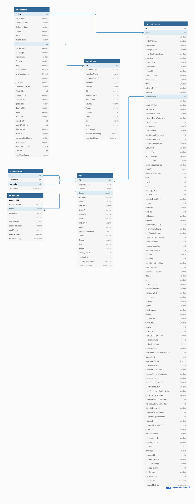

# Symbiota Occurrences
All Symbiota fields are loosely based on the [Darwin Core](https://dwc.tdwg.org/terms/)
specification for biological diversity data.

- An Institution refers to an institution that has custody of an 
  occurrence record
- A Collection (omcollection) refers to a collection of occurrence 
  records
- An Occurrence (omoccurrence) refers to an existence of an organism 
  at a particular place at a particular time
- A Taxon (taxa) is a group of organisms considered by taxonomists 
  to form a homogenous unit
- The Taxa Enum Tree (taxaenumtree) is a tree data structure providing 
  for quick lookups of taxonomic parents of any rank
- The Taxon Units table (taxonunits) contains the various taxonomic ranks that a 
  taxon can be assigned to (Kingdom, Phylum, Class, etc.)

